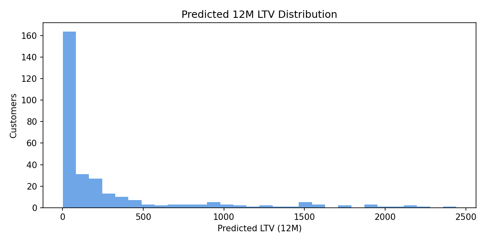
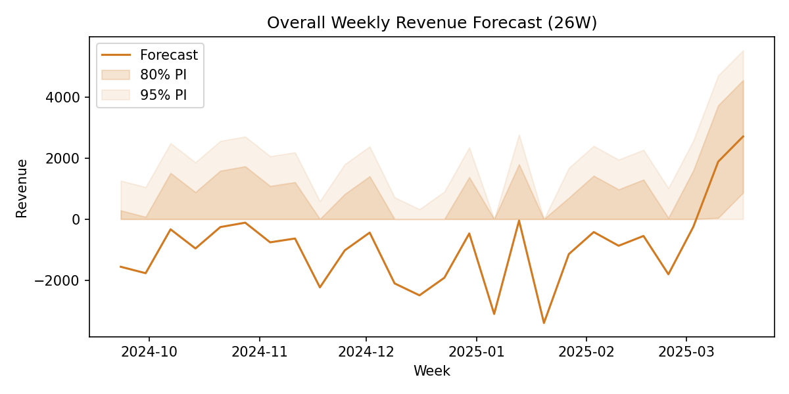

# Customer Lifetime Value Forecasting

Bulletproof customer economics for marketing, finance, and experimentation: probabilistic LTV, ETS-based revenue forecasting, and propensity-adjusted incrementality in one repo.

## Architecture at a Glance

```mermaid
flowchart LR
    A[Transactions + Behaviors] --> B[LTV Pipeline (lifetimes)]
    B -->|customer segments| C[Revenue Forecasting]
    A --> D[Marketing Interventions]
    D --> E[Causal Inference]
    C --> F[Dashboards]
    E --> F
    B --> F
```

## Quickstart
1. Create/activate a virtual environment (example for PowerShell): `python -m venv .venv; .\.venv\Scripts\activate`.
2. Install deps: `pip install -r requirements.txt`.
3. Rebuild every artifact (LTV, forecasts, causal report, figures): `python scripts/run_all.py`.
4. Launch the interactive dashboard: `streamlit run dashboards/app.py`.

## Visual Preview

| Predicted LTV Distribution | 26-Week Revenue Forecast | Causal Balance Check |
| --- | --- | --- |
|  |  |  |

## Key Outputs

| File | Purpose |
| --- | --- |
| `data/ltv_predictions.csv` | Customer-level BG/NBD + Gamma-Gamma predictions with expected orders + value. |
| `data/revenue_forecasts_*.csv` | Weekly forecasts (overall, segment, channel) with model metadata and prediction intervals. |
| `data/marketing_interventions.csv` | Biased treatment log for causal simulations (pre/post revenue + covariates). |
| `data/causal_results.csv` | Naive vs propensity/IPW lift estimates with confidence intervals. |
| `reports/final_report.md` | Executive-ready summary with insights, charts, and recommendations. |
| `dashboards/app.py` | Streamlit control room for KPIs, LTV segments, forecasts, and incrementality. |

## Business Impact & Methods
- **LTV** – Probabilistic buy-till-you-die + Gamma-Gamma stack surfaces top-decile share (~56%) so lifecycle teams defend premium cohorts.
- **Forecasting** – ETS models outperform seasonal-naive baselines (~70% lower RMSE) to drive near-term revenue guardrails and budget pacing.
- **Incrementality** – Propensity-score matching + IPW shows naive lift is 5x overstated, enabling credible ROI conversations with finance.

## Demo Commands
- Rebuild all assets: `python scripts/run_all.py`
- Launch dashboard: `streamlit run dashboards/app.py`

---

## Business Problem
Subscription, retail, and hybrid commerce orgs need precise visibility into future customer value to prioritize acquisition, retention, and upsell investments. This project delivers a reusable toolkit for estimating customer lifetime value (LTV) and revenue trajectories from transactional + behavioral data so marketing, finance, and product can align on audience targeting, cash-flow planning, and experimentation.

## Modeling Approach
1. **Data Layer** – Combine transactional purchase history, digital engagement, and marketing exposures into a clean analytical base table stored in DuckDB / SQL.
2. **Feature Engineering** – Compute RFM-style descriptors, cohort tags, behavioral embeddings, campaign touchpoints, and financial covariates.
3. **Modeling Stack**
   - Probabilistic buy-till-you-die models (`lifetimes`) for base LTV estimation.
   - Gradient boosted regression / survival models (`scikit-learn`) for heterogeneous uplift.
   - Time-series revenue forecasters (`statsmodels`, `prophet` alt) for top-down validations.
4. **Evaluation** – Rolling-origin validation with holdout cohorts, calibration plots, cost curves, and actionable segmentation thresholds.

## Experimentation & Causal Analysis Plan
- **Incrementality Tests** – Randomized audience splits for lifecycle programs, measuring lift on LTV using CUPED or diff-in-diff adjustments.
- **Geo / Time Staggered Launches** – Synthetic control / Bayesian structural time-series for product or pricing changes.
- **Causal Feature Insights** – Double ML or causal forests on behavioral features to understand high-leverage levers before scaling spend.
- **Experiment Registry** – Track hypotheses, assignment, KPIs, and posterior LTV impacts inside `experiments/`.

## Metrics & Evaluation
- Per-customer and cohort LTV (NPV, undiscounted).
- Revenue forecast accuracy (MAE/MAPE) at weekly + monthly horizons.
- Retention curves, churn hazard, and order-frequency calibration.
- Marketing efficiency: incremental revenue / cost, marginal ROAS, payback time.
- Experiment diagnostics: power, minimum detectable effect, bias checks.

## Getting Started (Detailed)
1. Create and activate the project virtual environment: `python -m venv .venv && .venv\Scripts\activate` (Windows) or `source .venv/bin/activate` (macOS/Linux).
2. Install requirements: `pip install -r requirements.txt`.
3. Explore the synthetic dataset via the notebooks under `notebooks/`. Update the ETL pipeline in `src/` as new data sources are connected.
4. Document learnings and experiment outcomes inside `reports/` and `experiments/`.
