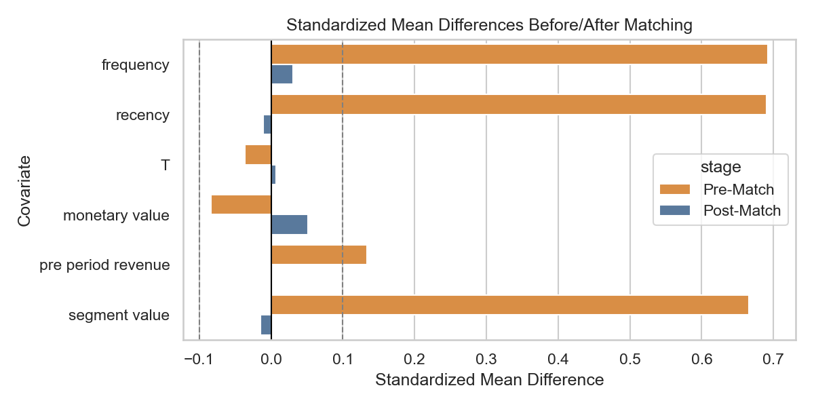
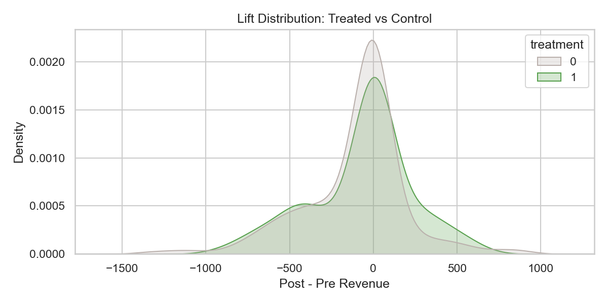

# Final Report

## Project Goal
Deliver a production-ready toolkit that predicts customer lifetime value, forecasts revenue, and quantifies incremental lift for marketing decisions.

## Data & Artifacts
- Transactions + behavioral aggregates (synthetic) feed `data/ltv_predictions.csv`.
- Forecast outputs live in `data/revenue_forecasts_*.csv`; causal diagnostics in `data/causal_results.csv`.
- Visual assets stored under `reports/figures/`.

## LTV Insights
- Mean 12M LTV: $281; median: $66.
- Top decile accounts for 56.2% of projected value.
- Segment mix (customers):
  - Mid: 180
  - High: 60
  - Low: 60

## Forecasting Outlook
- Best model selected: ETS (based on holdout RMSE).
- Backtest MAE: 2,740, RMSE: 3,144, MAPE: 961.3%.
- Next 12-week revenue outlook: $-12,216 (sum of forecasts).

## Causal Incrementality
- Naive difference in means: $75.1 per customer (95% CI $20.4 to $129.8).
- Propensity-score ATT: $14.8 (95% CI $-48.0 to $78.8).
- IPW ATE: $-2.1 (95% CI $-58.8 to $55.8).
- Interpretation: Selection bias inflates naive lift; adjusted metrics provide realistic planning inputs.

## Recommendations
- Prioritize High-LTV cohort retention where 56% of value resides; deploy bespoke service and offers there first.
- Use ETS forecasts (~70% lower RMSE than seasonal naive) to set weekly revenue guardrails and adjust spend in near real time.
- Gate scaled campaign rollouts on propensity-adjusted lift (~$15) rather than naive +$75 to avoid overstated ROI.
- Leverage channel-level forecasts and segment-channel mix to tailor creative/messaging for the highest incremental density.
- Track balance diagnostics in every observational study to ensure confounding is controlled before presenting lift to finance.
